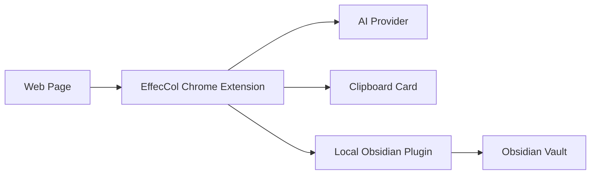

# EffecCol

[English](./README.md) | [简体中文](./README.zh-CN.md)

> Turn passive bookmarks into active knowledge capture.

EffecCol is a Chrome extension plus an Obsidian plugin for people who save a lot of great pages but rarely revisit them.

## Status

EffecCol is currently an **open-source v1 prototype**. The core flow works, installation is still manual, and GitHub release packages are now available, but browser store and Obsidian community distribution are not finished yet.

## Why This Project Exists

Most one-click bookmarking flows solve storage, but not retrieval.

Most saved links end up in a browser bookmark folder, a read-later app, or a clipping library, and then slowly disappear into backlog. The problem is not that we did not save them. The problem is that our future selves cannot quickly remember what was saved, why it mattered, or where to use it.

The note-taking method behind EffecCol is simple:

1. Save the full source into your knowledge base.
2. Put the title or summary into your own index, map, board, or outline.
3. Make retrieval easier for your brain, not just for search.

That is why this project is called **EffecCol**: short for **Effective Collection**.

## The Core Idea

EffecCol intentionally produces **two different outputs**:

- A structured Obsidian note for archival and long-term reference.
- A lighter clipboard card for manual placement into your own system.

This is important. The archive and the index should not be the same thing.

## What EffecCol Does

When you click the extension icon on a page, EffecCol will:

1. Extract the page title, URL, site name, selected text, and article content.
2. Generate an AI summary.
3. Save a structured note into your current Obsidian vault under `EffecCol/`.
4. Copy a lighter summary card to your clipboard.

The main flow stays quiet:

- no popup form
- no jump to Obsidian
- no extra confirmation on each capture

## Two Outputs, Two Jobs

### 1. Obsidian Note

The saved note is for knowledge-base storage. It includes:

- frontmatter / Properties
- title
- AI summary
- cleaned article body
- source link
- downloaded article images when available

### 2. Clipboard Card

The clipboard card is for manual placement into your own working context. Depending on settings, it can include:

- title
- AI summary
- Obsidian note path
- Obsidian deep link
- source URL

This makes it easy to paste into your own notes, dashboard, whiteboard, outline, or planning doc.

## Current Features

- One-click capture with page-level toast feedback
- Silent local save into the currently opened Obsidian vault
- AI summary generation with fallback when the model call fails
- Clipboard card presets and field-level customization
- Support for DeepSeek, OpenAI, Anthropic, and OpenAI-compatible endpoints
- Article images saved under `EffecCol/_assets/` when possible
- Better handling for WeChat articles, including title and image extraction improvements
- Warning flow for low-value pages such as forum threads or index-like pages
- Local pairing token between the browser extension and the Obsidian plugin

## How It Works



## Installation

### Requirements

- A Chromium-based browser
- Obsidian desktop
- Community plugins enabled in Obsidian
- An API key for your chosen AI provider

### 1. Load the browser extension

1. Open `chrome://extensions`
2. Turn on Developer Mode
3. Click `Load unpacked`
4. Select this project folder: `obsidian-post-capture-extension/`

### 2. Install the Obsidian plugin

Copy `effecol-obsidian-plugin/` into your vault at:

```text
.obsidian/plugins/effecol/
```

Then enable `EffecCol` inside:

1. `Settings`
2. `Community plugins`
3. Find `EffecCol`
4. Turn it on

### 3. Keep Obsidian open

The current v1 uses a local plugin running inside Obsidian, so Obsidian desktop needs to stay open while capturing.

### 4. Configure AI

Open the extension options page and fill in:

- AI provider
- API key

Optional settings include:

- model
- endpoint
- summary length
- summary preference
- clipboard card preset

## Quick Start

If you want to try the project with the least amount of setup:

1. Load the Chrome extension from this folder.
2. Copy `effecol-obsidian-plugin/` into your Obsidian vault plugin directory.
3. Enable the `EffecCol` plugin in Obsidian.
4. Open the extension settings and add your AI API key.
5. Open any article page and click the extension icon.

## Typical Workflow

1. Open a content page.
2. Optionally select a key paragraph.
3. Click the `EffecCol` extension icon.
4. Wait for the toast saying it is saving.
5. The full note lands in Obsidian.
6. Paste the clipboard card into your own index or workflow.

## Privacy and Data Flow

- Your Obsidian note is written locally through the Obsidian plugin.
- Your API keys are stored in the browser locally.
- The extracted page content is sent to the AI provider you configured, only for summary generation.
- Clipboard writing happens locally through the browser.

## Repository Structure

- `manifest.json`  
  Chrome extension manifest
- `background.js`  
  main capture flow
- `shared.js`  
  shared templates and pure helpers
- `options.html` / `options.js`  
  settings page
- `popup.html` / `popup.js`  
  status and recovery page
- `offscreen.html` / `offscreen.js`  
  clipboard writing
- `effecol-obsidian-plugin/`  
  Obsidian plugin for local save
- `TEST_REPORT.md`  
  local manual testing notes during development

## Project Status

EffecCol is currently a working v1 prototype.

What that means:

- core flow works
- manual installation is still required
- Obsidian must stay open
- article extraction and image handling are still being improved
- GitHub release packages are available for manual installation
- the browser extension is not yet published to a store
- the Obsidian plugin is not yet packaged for official community distribution

## Roadmap

- Better article extraction across more sites
- Better low-value page detection
- Smoother first-run onboarding
- Browser store and community distribution packaging
- More reliable image downloading and rendering

## Contributing

Issues and pull requests are welcome.

If you want to help, the most useful contributions right now are:

- article extraction edge cases
- image handling across different sites
- onboarding and setup clarity
- release engineering

For contribution and project policies, see:

- [CONTRIBUTING.md](./CONTRIBUTING.md)
- [CODE_OF_CONDUCT.md](./CODE_OF_CONDUCT.md)
- [SECURITY.md](./SECURITY.md)
- [CHANGELOG.md](./CHANGELOG.md)
- [LICENSE](./LICENSE)

## Philosophy in One Sentence

EffecCol is not about collecting more. It is about collecting in a way that stays usable.
