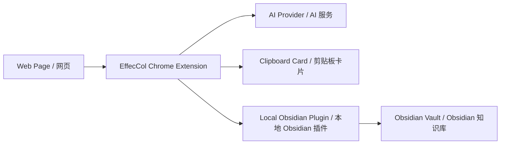

# EffecCol

> Turn passive bookmarks into active knowledge capture.  
> 把“收藏夹吃灰”变成“有效收藏”。

EffecCol is a Chrome extension plus an Obsidian plugin for people who save a lot of great pages but rarely revisit them.

EffecCol 是一个 Chrome 扩展加 Obsidian 插件，面向那些经常遇到好内容、先收藏、却很少再回头看的人。

## Status | 当前状态

EffecCol is currently an **open-source v1 prototype**. The core flow works, but installation is still manual and public release packaging is not finished yet.

EffecCol 目前是一个 **开源的 v1 原型**。核心流程已经可用，但安装仍然偏手动，面向公开发布的打包和分发还没有完成。

## Why This Project Exists | 这个项目解决什么问题

Most one-click bookmarking flows solve storage, but not retrieval.

Most saved links end up in a browser bookmark folder, a read-later app, or a clipping library, and then slowly disappear into backlog. The problem is not that we did not save them. The problem is that our future selves cannot quickly remember what was saved, why it mattered, or where to use it.

大多数“一键收藏”只解决了“存下来”，没有解决“以后还能被想起来、被找到、被继续使用”。

很多网页收藏之后会留在浏览器收藏夹、稍后读工具或者剪藏库里，最后慢慢吃灰。问题不在于我们没有保存，而在于未来的自己很难快速回忆：当时为什么要存、内容重点是什么、它应该被放进哪条思考链路里。

The note-taking method behind EffecCol is simple:

EffecCol 背后的笔记方法很简单：

1. Save the full source into your knowledge base.
2. Put the title or summary into your own index, map, board, or outline.
3. Make retrieval easier for your brain, not just for search.

1. 把原文完整存进知识库。
2. 把标题或总结放进你自己的索引、白板、地图或大纲里。
3. 让大脑更容易“想起它”，而不只是“搜到它”。

That is why this project is called **EffecCol**: short for **Effective Collection**, or in Chinese, **有效收藏**.

这也是项目名 **EffecCol** 的来源：它来自 **Effective Collection**，也就是中文里的 **有效收藏**。

## The Core Idea | 核心思路

EffecCol intentionally produces **two different outputs**:

EffecCol 故意把一次收藏拆成了 **两种不同的输出**：

- A structured Obsidian note for archival and long-term reference.
- A lighter clipboard card for manual placement into your own system.

- 一份结构化的 Obsidian 笔记，用来归档和长期参考。
- 一张更轻的剪贴板卡片，用来手动放进你自己的索引系统。

This is important. The archive and the index should not be the same thing.

这点很重要。归档和索引，本来就不应该是同一件事。

## What EffecCol Does | EffecCol 做什么

When you click the extension icon on a page, EffecCol will:

当你在网页上点击扩展图标时，EffecCol 会：

1. Extract the page title, URL, site name, selected text, and article content.
2. Generate an AI summary.
3. Save a structured note into your current Obsidian vault under `EffecCol/`.
4. Copy a lighter summary card to your clipboard.

1. 提取页面标题、链接、站点名、选中文本和正文内容。
2. 生成 AI 摘要。
3. 把结构化笔记保存到当前 Obsidian vault 的 `EffecCol/` 目录。
4. 把一张更轻量的摘要卡片复制到剪贴板。

The main flow stays quiet:

主流程会尽量保持安静：

- no popup form
- no jump to Obsidian
- no extra confirmation on each capture

- 不弹表单
- 不跳转 Obsidian
- 不在每次收藏时额外确认

## Two Outputs, Two Jobs | 两类输出，各司其职

### 1. Obsidian Note | Obsidian 笔记

The saved note is for knowledge-base storage. It includes:

保存到 Obsidian 的笔记偏向知识库归档，通常包括：

- frontmatter / Properties
- title
- AI summary
- cleaned article body
- source link
- downloaded article images when available

- frontmatter / Properties
- 标题
- AI 摘要
- 清洗后的网页正文
- 原始链接
- 能下载时尽量本地保存的正文图片

### 2. Clipboard Card | 剪贴板卡片

The clipboard card is for manual placement into your own working context. Depending on settings, it can include:

剪贴板卡片是给你手动放进自己工作流里的。根据设置，它可以包含：

- title
- AI summary
- Obsidian note path
- Obsidian deep link
- source URL

- 标题
- AI 摘要
- Obsidian 笔记路径
- Obsidian 深链
- 原文链接

This makes it easy to paste into your own notes, dashboard, whiteboard, outline, or planning doc.

这样你就可以很方便地把它粘贴到自己的笔记、仪表盘、白板、大纲或计划文档里。

## Current Features | 当前能力

- One-click capture with page-level toast feedback
- Silent local save into the currently opened Obsidian vault
- AI summary generation with fallback when the model call fails
- Clipboard card presets and field-level customization
- Support for DeepSeek, OpenAI, Anthropic, and OpenAI-compatible endpoints
- Article images saved under `EffecCol/_assets/` when possible
- Warning flow for low-value pages such as forum threads or index-like pages
- Local pairing token between the browser extension and the Obsidian plugin

- 一键收藏，并在页面内给出轻提示
- 静默保存到当前打开的 Obsidian vault
- AI 摘要生成，失败时自动降级不阻断保存
- 支持剪贴板卡片预设和字段级配置
- 支持 DeepSeek、OpenAI、Anthropic 和 OpenAI 兼容接口
- 正文图片尽量保存到 `EffecCol/_assets/`
- 对论坛串、索引页等低价值页面先提醒再决定是否继续保存
- 浏览器扩展与 Obsidian 插件之间使用本地配对 token

## How It Works | 工作方式



## Installation | 安装方式

### Requirements | 前提条件

- A Chromium-based browser
- Obsidian desktop
- Community plugins enabled in Obsidian
- An API key for your chosen AI provider

- Chromium 内核浏览器
- Obsidian 桌面端
- 已开启 Obsidian 社区插件能力
- 你选择的 AI 服务的 API Key

### 1. Load the browser extension | 加载浏览器扩展

1. Open `chrome://extensions`
2. Turn on Developer Mode
3. Click `Load unpacked`
4. Select this project folder: `obsidian-post-capture-extension/`

1. 打开 `chrome://extensions`
2. 打开开发者模式
3. 点击“加载已解压的扩展程序”
4. 选择当前项目目录：`obsidian-post-capture-extension/`

### 2. Install the Obsidian plugin | 安装 Obsidian 插件

Copy `effecol-obsidian-plugin/` into your vault at:

把 `effecol-obsidian-plugin/` 复制到你的 vault 中：

```text
.obsidian/plugins/effecol/
```

Then enable `EffecCol` inside:

然后在 Obsidian 中启用 `EffecCol`：

1. `Settings`
2. `Community plugins`
3. Find `EffecCol`
4. Turn it on

1. `Settings`
2. `Community plugins`
3. 找到 `EffecCol`
4. 打开开关

### 3. Keep Obsidian open | 保持 Obsidian 打开

The current v1 uses a local plugin running inside Obsidian, so Obsidian desktop needs to stay open while capturing.

当前 v1 的本地保存能力由 Obsidian 内部插件提供，因此在收藏时需要保持 Obsidian 桌面端处于打开状态。

### 4. Configure AI | 配置 AI

Open the extension options page and fill in:

打开扩展设置页后，至少填写：

- AI provider
- API key

- API 厂商
- API Key

Optional settings include:

可选项包括：

- model
- endpoint
- summary length
- summary preference
- clipboard card preset

- 模型名
- endpoint
- 摘要长度
- 摘要偏好
- 剪贴板卡片预设

## Quick Start | 快速开始

If you want to try the project with the least amount of setup:

如果你想用最少的步骤试起来：

1. Load the Chrome extension from this folder.
2. Copy `effecol-obsidian-plugin/` into your Obsidian vault plugin directory.
3. Enable the `EffecCol` plugin in Obsidian.
4. Open the extension settings and add your AI API key.
5. Open any article page and click the extension icon.

1. 把这个目录加载为 Chrome 扩展。
2. 把 `effecol-obsidian-plugin/` 复制到你的 Obsidian vault 插件目录。
3. 在 Obsidian 中启用 `EffecCol` 插件。
4. 打开扩展设置页，填入 AI API Key。
5. 打开任意文章页，点击扩展图标。

## Typical Workflow | 典型使用方式

1. Open a content page.
2. Optionally select a key paragraph.
3. Click the `EffecCol` extension icon.
4. Wait for the toast saying it is saving.
5. The full note lands in Obsidian.
6. Paste the clipboard card into your own index or workflow.

1. 打开一篇内容网页。
2. 如果有关键段落，可以先选中。
3. 点击 `EffecCol` 扩展图标。
4. 等待页面提示它正在保存。
5. 完整笔记进入 Obsidian。
6. 把剪贴板卡片粘贴进你自己的索引或工作流中。

## Privacy and Data Flow | 隐私与数据流

- Your Obsidian note is written locally through the Obsidian plugin.
- Your API keys are stored in the browser locally.
- The extracted page content is sent to the AI provider you configured, only for summary generation.
- Clipboard writing happens locally through the browser.

- Obsidian 笔记通过本地 Obsidian 插件写入。
- API Key 保存在浏览器本地。
- 提取到的网页内容会发送给你配置的 AI 服务，仅用于生成摘要。
- 剪贴板写入在本地浏览器内完成。

## Repository Structure | 仓库结构

- `manifest.json`  
  Chrome extension manifest
- `background.js`  
  main capture flow
- `shared.js`  
  shared templates and pure helpers
- `options.html` / `options.js`  
  settings page
- `popup.html` / `popup.js`  
  status and recovery page
- `offscreen.html` / `offscreen.js`  
  clipboard writing
- `effecol-obsidian-plugin/`  
  Obsidian plugin for local save
- `TEST_REPORT.md`  
  local manual testing notes during development

- `manifest.json`  
  Chrome 扩展清单
- `background.js`  
  主收藏流程
- `shared.js`  
  共用模板与纯函数
- `options.html` / `options.js`  
  设置页
- `popup.html` / `popup.js`  
  状态与补救页
- `offscreen.html` / `offscreen.js`  
  剪贴板写入
- `effecol-obsidian-plugin/`  
  负责本地保存的 Obsidian 插件
- `TEST_REPORT.md`  
  开发过程中的本地手工测试记录

## Project Status | 项目状态

EffecCol is currently a working v1 prototype.

EffecCol 目前是一个可用的 v1 原型。

What that means:

这意味着：

- core flow works
- manual installation is still required
- Obsidian must stay open
- article extraction and image handling are still being improved
- the browser extension is not yet published to a store
- the Obsidian plugin is not yet packaged for official community distribution

- 核心流程已经可用
- 目前仍需要手动安装
- 需要保持 Obsidian 打开
- 正文提取和图片处理仍在持续优化
- 浏览器扩展还没有上架商店
- Obsidian 插件还没有做成官方社区分发形态

## Roadmap | 路线图

- Better article extraction across more sites
- Better low-value page detection
- Smoother first-run onboarding
- Packaging for public release
- More reliable image downloading and rendering

- 支持更多网站的更稳正文提取
- 更准确的低价值页面判断
- 更顺滑的首次安装与引导
- 面向公开发布的打包与分发
- 更稳定的图片下载与渲染链路

## Contributing | 贡献

Issues and pull requests are welcome.

欢迎提 Issue 和 Pull Request。

If you want to help, the most useful contributions right now are:

如果你想参与，这几个方向当前最有价值：

- article extraction edge cases
- image handling across different sites
- onboarding and setup clarity
- release engineering

- 正文提取边界情况
- 不同网站的图片处理
- 安装与引导体验
- 发布工程化

For contribution and project policies, see:

关于贡献与项目协作，请查看：

- [CONTRIBUTING.md](./CONTRIBUTING.md)
- [CODE_OF_CONDUCT.md](./CODE_OF_CONDUCT.md)
- [SECURITY.md](./SECURITY.md)
- [CHANGELOG.md](./CHANGELOG.md)
- [LICENSE](./LICENSE)

## Philosophy in One Sentence | 用一句话概括

EffecCol is not about collecting more. It is about collecting in a way that stays usable.

EffecCol 不是为了让你收藏更多，而是为了让收藏真正变得可用。
