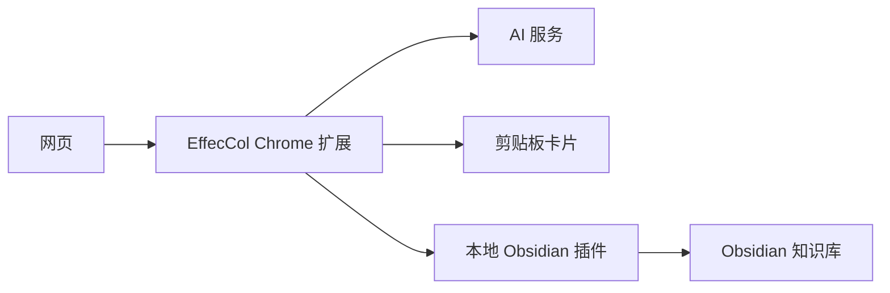

# EffecCol

[English](./README.md) | [简体中文](./README.zh-CN.md)

> 把“收藏夹吃灰”变成“有效收藏”。

EffecCol 是一个 Chrome 扩展加 Obsidian 插件，面向那些经常遇到好内容、先收藏、却很少再回头看的人。

## 当前状态

EffecCol 目前是一个 **开源的 v1 原型**。核心流程已经可用，安装仍然偏手动，GitHub Releases 的发布包已经可用，但浏览器商店和 Obsidian 社区市场分发还没有完成。

## 这个项目解决什么问题

大多数“一键收藏”只解决了“存下来”，没有解决“以后还能被想起来、被找到、被继续使用”。

很多网页收藏之后会留在浏览器收藏夹、稍后读工具或者剪藏库里，最后慢慢吃灰。问题不在于我们没有保存，而在于未来的自己很难快速回忆：当时为什么要存、内容重点是什么、它应该被放进哪条思考链路里。

EffecCol 背后的笔记方法很简单：

1. 把原文完整存进知识库。
2. 把标题或总结放进你自己的索引、白板、地图或大纲里。
3. 让大脑更容易“想起它”，而不只是“搜到它”。

这也是项目名 **EffecCol** 的来源：它来自 **Effective Collection**，也就是中文里的 **有效收藏**。

## 核心思路

EffecCol 故意把一次收藏拆成了 **两种不同的输出**：

- 一份结构化的 Obsidian 笔记，用来归档和长期参考。
- 一张更轻的剪贴板卡片，用来手动放进你自己的索引系统。

这点很重要。归档和索引，本来就不应该是同一件事。

## EffecCol 做什么

当你在网页上点击扩展图标时，EffecCol 会：

1. 提取页面标题、链接、站点名、选中文本和正文内容。
2. 生成 AI 摘要。
3. 把结构化笔记保存到当前 Obsidian vault 的 `EffecCol/` 目录。
4. 把一张更轻量的摘要卡片复制到剪贴板。

主流程会尽量保持安静：

- 不弹表单
- 不跳转 Obsidian
- 不在每次收藏时额外确认

## 两类输出，各司其职

### 1. Obsidian 笔记

保存到 Obsidian 的笔记偏向知识库归档，通常包括：

- frontmatter / Properties
- 标题
- AI 摘要
- 清洗后的网页正文
- 原始链接
- 能下载时尽量本地保存的正文图片

### 2. 剪贴板卡片

剪贴板卡片是给你手动放进自己工作流里的。根据设置，它可以包含：

- 标题
- AI 摘要
- Obsidian 笔记路径
- Obsidian 深链
- 原文链接

这样你就可以很方便地把它粘贴到自己的笔记、仪表盘、白板、大纲或计划文档里。

## 当前能力

- 一键收藏，并在页面内给出轻提示
- 静默保存到当前打开的 Obsidian vault
- AI 摘要生成，失败时自动降级不阻断保存
- 支持剪贴板卡片预设和字段级配置
- 支持 DeepSeek、OpenAI、Anthropic 和 OpenAI 兼容接口
- 正文图片尽量保存到 `EffecCol/_assets/`
- 已增强微信公众号场景下的标题和图片提取
- 对论坛串、索引页等低价值页面先提醒再决定是否继续保存
- 浏览器扩展与 Obsidian 插件之间使用本地配对 token

## 工作方式



## 安装方式

### 前提条件

- Chromium 内核浏览器
- Obsidian 桌面端
- 已开启 Obsidian 社区插件能力
- 你选择的 AI 服务的 API Key

### 1. 加载浏览器扩展

1. 打开 `chrome://extensions`
2. 打开开发者模式
3. 点击“加载已解压的扩展程序”
4. 选择当前项目目录：`obsidian-post-capture-extension/`

### 2. 安装 Obsidian 插件

把 `effecol-obsidian-plugin/` 复制到你的 vault 中：

```text
.obsidian/plugins/effecol/
```

然后在 Obsidian 中启用 `EffecCol`：

1. `Settings`
2. `Community plugins`
3. 找到 `EffecCol`
4. 打开开关

### 3. 保持 Obsidian 打开

当前 v1 的本地保存能力由 Obsidian 内部插件提供，因此在收藏时需要保持 Obsidian 桌面端处于打开状态。

### 4. 配置 AI

打开扩展设置页后，至少填写：

- API 厂商
- API Key

可选项包括：

- 模型名
- endpoint
- 摘要长度
- 摘要偏好
- 剪贴板卡片预设

## 快速开始

如果你想用最少的步骤试起来：

1. 把这个目录加载为 Chrome 扩展。
2. 把 `effecol-obsidian-plugin/` 复制到你的 Obsidian vault 插件目录。
3. 在 Obsidian 中启用 `EffecCol` 插件。
4. 打开扩展设置页，填入 AI API Key。
5. 打开任意文章页，点击扩展图标。

## 典型使用方式

1. 打开一篇内容网页。
2. 如果有关键段落，可以先选中。
3. 点击 `EffecCol` 扩展图标。
4. 等待页面提示它正在保存。
5. 完整笔记进入 Obsidian。
6. 把剪贴板卡片粘贴进你自己的索引或工作流中。

## 隐私与数据流

- Obsidian 笔记通过本地 Obsidian 插件写入。
- API Key 保存在浏览器本地。
- 提取到的网页内容会发送给你配置的 AI 服务，仅用于生成摘要。
- 剪贴板写入在本地浏览器内完成。

## 仓库结构

- `manifest.json`  
  Chrome 扩展清单
- `background.js`  
  主收藏流程
- `shared.js`  
  共用模板与纯函数
- `options.html` / `options.js`  
  设置页
- `popup.html` / `popup.js`  
  状态与补救页
- `offscreen.html` / `offscreen.js`  
  剪贴板写入
- `effecol-obsidian-plugin/`  
  负责本地保存的 Obsidian 插件
- `TEST_REPORT.md`  
  开发过程中的本地手工测试记录

## 项目状态

EffecCol 目前是一个可用的 v1 原型。

这意味着：

- 核心流程已经可用
- 目前仍需要手动安装
- 需要保持 Obsidian 打开
- 正文提取和图片处理仍在持续优化
- 已经提供可手动下载安装的 GitHub Releases 发布包
- 浏览器扩展还没有上架商店
- Obsidian 插件还没有做成官方社区分发形态

## 路线图

- 支持更多网站的更稳正文提取
- 更准确的低价值页面判断
- 更顺滑的首次安装与引导
- 面向浏览器商店与社区市场的打包与分发
- 更稳定的图片下载与渲染链路

## 贡献

欢迎提 Issue 和 Pull Request。

如果你想参与，这几个方向当前最有价值：

- 正文提取边界情况
- 不同网站的图片处理
- 安装与引导体验
- 发布工程化

关于贡献与项目协作，请查看：

- [CONTRIBUTING.md](./CONTRIBUTING.md)
- [CODE_OF_CONDUCT.md](./CODE_OF_CONDUCT.md)
- [SECURITY.md](./SECURITY.md)
- [CHANGELOG.md](./CHANGELOG.md)
- [LICENSE](./LICENSE)

## 用一句话概括

EffecCol 不是为了让你收藏更多，而是为了让收藏真正变得可用。
